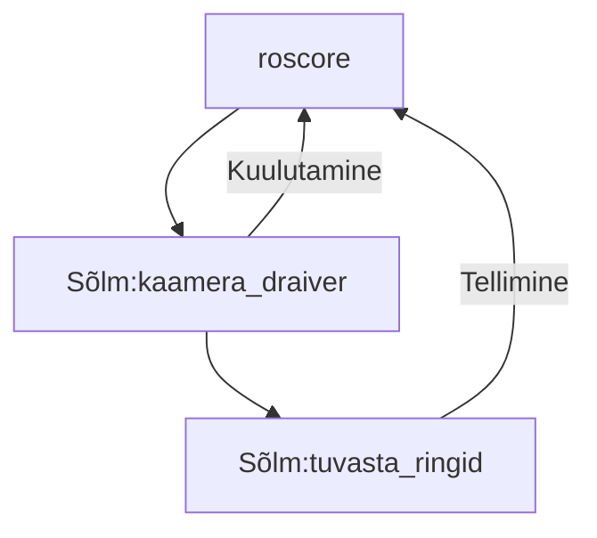

# ROS

## Arengusuunad kaasaegses tööstusrobootikas

Robotid võivad olla väga erineva kuju ja suurusega. Raske täpselt määratleda.
Ajajooksul on arenenud tehnoloogia ja arusaamad, kuidas kasutada ja milliseid roboteid tööstustel vaja läheb.

### Tööstus 3.0

- Eesmärk luua tehased, kus poleks mittemingit inimsekkumist.
- Need robotid on väga rangelt määratud töötama ainult oma töökeskkonnas.
- Muudatuste tegemine tööprotsessides on keeruline: on kulukas ajaliselt ja rahaliselt.
- Kasutavad need, kes toodavad suureskoguses ühesuguseid asju. Näiteks autotööstus.

### Tööstus 4.0

- Suurendada automatiseeritud tootmisliinide paindlikust.
- Integreerida robotid küberfüüsikalisse süsteemi. Mille ülesandeid saab hõlpsamini muuta. Muutes tootmisliini toodangut vastavalt vajadusele.
- Tehase ümberseadistamine pilveteenuste kaudu. 

### Tööstus 5.0

- Inimese ja roboti koostöö. 
- Võimalikult efektiive tootmisprotsess arvestades mõlema osapoole tugevusi ja nõrkusi. Kasutades inimese mõistust ja rutiine töö delegeeritud robotile.

### Logistika

- Robotiseeritud laohooned. Robotitel liikuvad kaubad ja tarvikud.
- "Viimase miili" robotkullerid.

### Ohtlikud ja raskesti juurdepääsetavad olud

On ajalooliselt olnud üks peamisi arenguvedureid.

### Põllumajandus

- Vajadus hooajalise tööjõu järele

### Tervishoid

- Täpsed ja kaug teel juhitavad operatsioonid
- Välisskelett liikumisvõimetule inimesele. Robotproteesid.

### Teenindusrobotid

### Transport

### Kaitse tööstus

### Kodus

- tolm, muru

## ROS

ROS on avatud lähtekoodiga tarkvaraarenduse komplekt, mis on mõeldud robootika rakendusteks.

Ros pakub standardiseeritud tarkvaraplatvormi mistahes valdkonna tehnoloogiaarendajatele, et kanda neid uurimustööst ja prototüüpidest kuni rakenduste ja tootmiseni.

Python, C++

Arendust kordineerib **Open Robotics**

- Uus robot kiiremini turule ja kasutajateni (YANU, 10LINES, SONY aibo)
- Võimalus viia loodud tarkvara ühe roboti pealt teisele tootja robotile.
- Ärisõbralik. Ärisaladused j

ROS industrial liikmed: [rosindustrial.org/ric/current-members](https://rosindustrial.org/ric/current-members)

## Eestis arendatavad ROSi baasil robotid

- [yanu.ai](https://yanu.ai/)
- [10-lines.com](https://10-lines.com/)
- [starship.xyz](https://www.starship.xyz/)
- [auve.tech](https://auve.tech/)
- [clevon.com](https://clevon.com/et/)
- [threod.com](https://threod.com/)
- [milremrobotics.com](https://milremrobotics.com/)

## Terminid

- **Kimp** (_package_) - funktsionaalne kogum sõlmi
- **Sõlm** (_node_) - konkreetsele ülesandele pühendatud programm
- **Sõnum** (_message_) - edastav infokild (struktureeritud)
- **Rubriik** (_topic_) - sõnumivoo sisuline nimetus
- **Kuulutaja** (_publisher_) - sõlme osa, mis kuulutab sõnumeid kindlas rubriigis. Üks sõlm võib kuulutada sõnumeid rubriigis, millel on mitmeid tellijaid.
- **Tellija** (_subscriber_) - sõlme osa, mis jälgib ja reageerib sõnumitele kindlas rubriigis
- **Tuum** (_roscore_) - alati taustal, viib sõlmi omavahel kokku (, et sõnumid liiguks otse)

- **rosrun** - ühe ROSi sõlme käitamine, roscore peab juba taustal töötama `rosrun kimbu_nimi sõlme_nimi`. Näiteks: `rosrun teleop_twist_keyboard teleop_twist_keyboard.py`
- **roslaunch** - mitme ROSi sõlme käivitamine, vajalik käivitusfail. `roslaunch kimbu_nimi käivitusfail`. Näiteks: `roslaunch robotont_demos teleop_keyboard.launch`

## ROSi kimpude (_package_) paigaldamine

1. Olemas oleva Ubuntu tarkvara paketi paigaldamine `sudo apt install kimbu_nimi`
2. Kompileerimine lähtekoodist kasutades **catkin**i

- ROSi kimpude kompileerimiseks on vaja catkini tööruumi (_catkin workspace_)
- Catkini tööruum on kaust, milles on lähtekoodi alamkaust `src/`
- Kompileerimiseks `catkin build` või `catkin_make`
- Tekivad alamkaustad `build/` ja `devel/`
- Kompileeritud catkin tööruumi laadimine `devel/setup.bash`

### Catkin tööruumi korraldus

- catkin_ws/
  - build/
  - devel/
  - src/
    - rosi_kimp_1/
      - include/
      - launch/
      - src/
      - CMakeLists.txt
      - package.xml
    - rosi_kimp_2/
      - include/
      - launch/
      - src/
      - CMakeLists.txt
      - package.xml

## ROS hajussüsteemides

ROS töötab ka hajussüsteemides - see tähendab süsteemides, kus võrku on ühendatud ja ülesandeid täidavad mitu arvutit.

On üks seade, kus jookseb ROSi tuum ehk **roscore**. Teised seadmed peavad asuma samas võrgus (N: Wifi võrgus). Neile tuleb teada anda, kus asub tuum.

## Kasutatud materjalid

- [robotont.ut.ee](http://robotont.ut.ee/)
- [ROSi algkursus](https://sisu.ut.ee/rosak/avaleht)
- https://moveit.ros.org/
- [ROSi paigaldamine Ubuntus](http://wiki.ros.org/noetic/Installation/Ubuntu)
- [micro-ROS for Arduino](https://github.com/micro-ROS/micro_ros_arduino)
