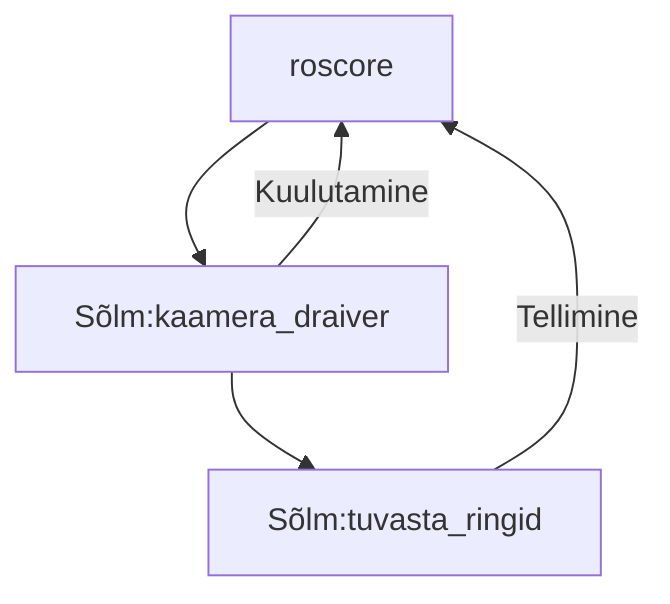
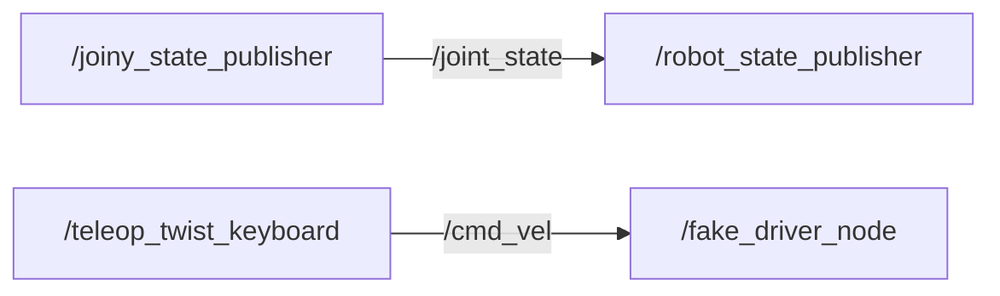
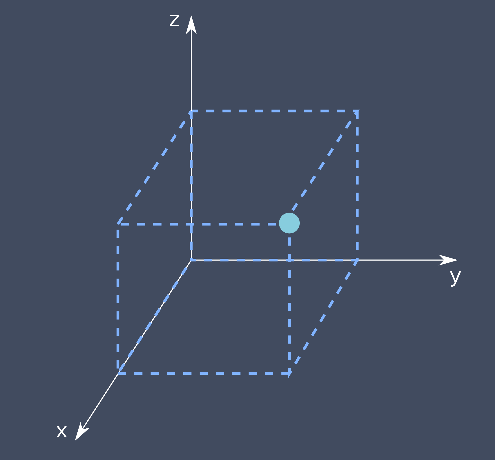
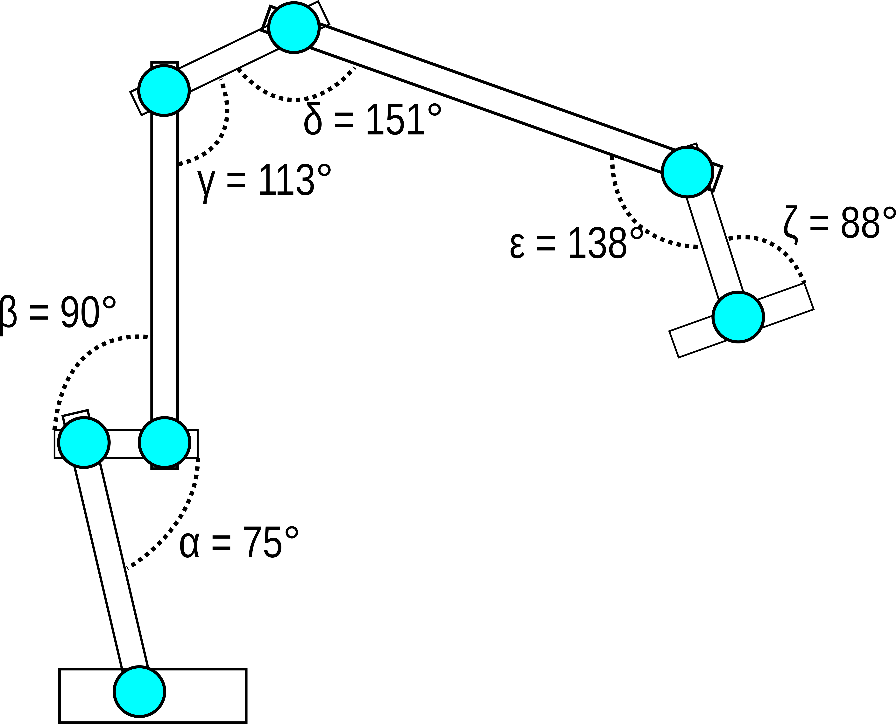
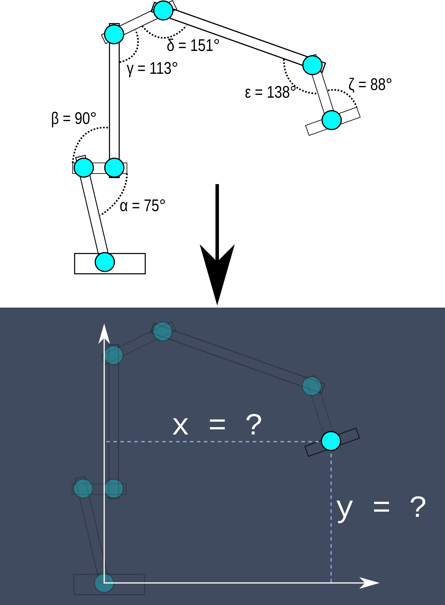
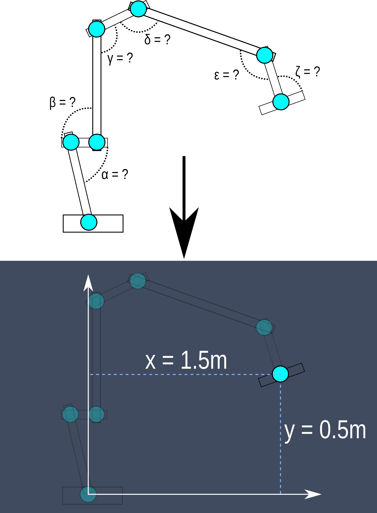
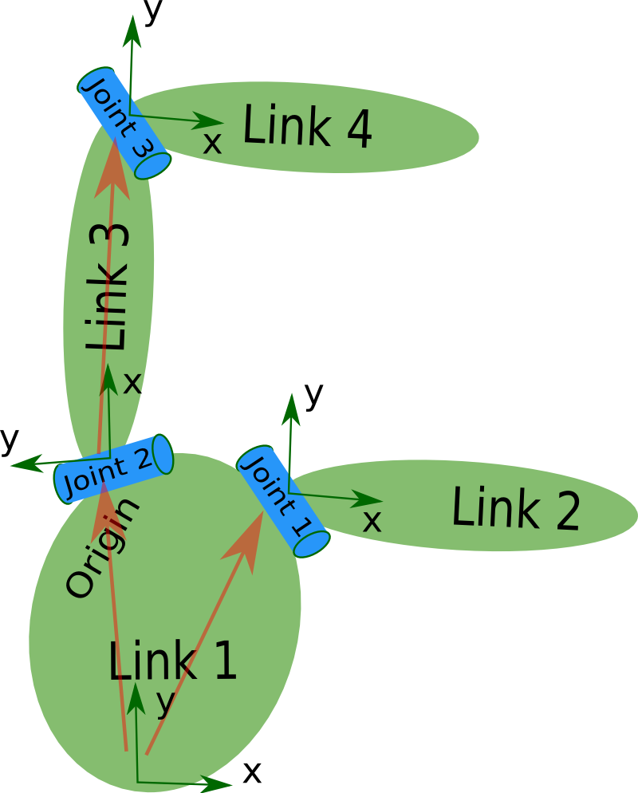
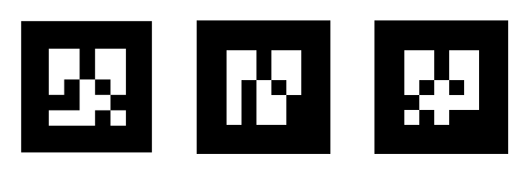
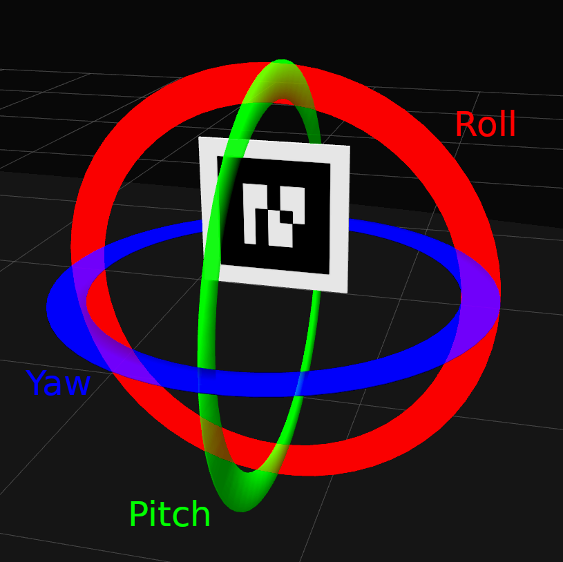
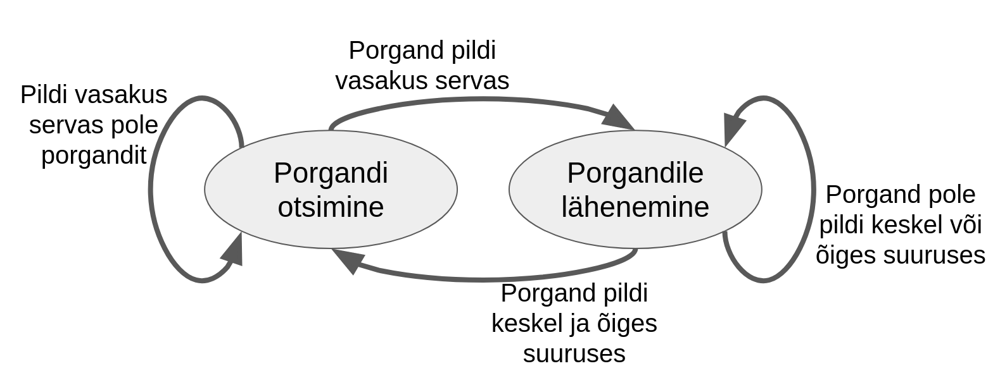

# ROS1

## Arengusuunad kaasaegses tööstusrobootikas

Robotid võivad olla väga erineva kuju ja suurusega. Raske täpselt määratleda.
Ajajooksul on arenenud tehnoloogia ja arusaamad, kuidas kasutada ja milliseid roboteid tööstustel vaja läheb.

### Tööstus 3.0

- Eesmärk luua tehased, kus poleks mittemingit inimsekkumist.
- Need robotid on väga rangelt määratud töötama ainult oma töökeskkonnas.
- Muudatuste tegemine tööprotsessides on keeruline: on kulukas ajaliselt ja rahaliselt.
- Kasutavad need, kes toodavad suureskoguses ühesuguseid asju. Näiteks autotööstus.

### Tööstus 4.0

- Suurendada automatiseeritud tootmisliinide paindlikust.
- Integreerida robotid küberfüüsikalisse süsteemi. Mille ülesandeid saab hõlpsamini muuta. Muutes tootmisliini toodangut vastavalt vajadusele.
- Tehase ümberseadistamine pilveteenuste kaudu. 

### Tööstus 5.0

- Inimese ja roboti koostöö. 
- Võimalikult efektiive tootmisprotsess arvestades mõlema osapoole tugevusi ja nõrkusi. Kasutades inimese mõistust ja rutiine töö delegeeritud robotile.

### Logistika

- Robotiseeritud laohooned. Robotitel liikuvad kaubad ja tarvikud.
- "Viimase miili" robotkullerid.

### Ohtlikud ja raskesti juurdepääsetavad olud

On ajalooliselt olnud üks peamisi arenguvedureid.

### Põllumajandus

- Vajadus hooajalise tööjõu järele

### Tervishoid

- Täpsed ja kaug teel juhitavad operatsioonid
- Välisskelett liikumisvõimetule inimesele. Robotproteesid.

### Teenindusrobotid

### Transport

### Kaitse tööstus

### Kodus

- tolm, muru

## ROS

ROS on avatud lähtekoodiga tarkvaraarenduse komplekt, mis on mõeldud robootika rakendusteks.

Ros pakub standardiseeritud tarkvaraplatvormi mistahes valdkonna tehnoloogiaarendajatele, et kanda neid uurimustööst ja prototüüpidest kuni rakenduste ja tootmiseni.

Python, C++

Arendust kordineerib **Open Robotics**

- Uus robot kiiremini turule ja kasutajateni (YANU, 10LINES, SONY aibo)
- Võimalus viia loodud tarkvara ühe roboti pealt teisele tootja robotile.
- Ärisõbralik. Ärisaladused j

ROS industrial liikmed: [rosindustrial.org/ric/current-members](https://rosindustrial.org/ric/current-members)

## Eestis arendatavad ROSi baasil robotid

- [yanu.ai](https://yanu.ai/)
- [10-lines.com](https://10-lines.com/)
- [starship.xyz](https://www.starship.xyz/)
- [auve.tech](https://auve.tech/)
- [clevon.com](https://clevon.com/et/)
- [threod.com](https://threod.com/)
- [milremrobotics.com](https://milremrobotics.com/)


## 2. Terminid

- **Kimp** (_package_) - funktsionaalne kogum sõlmi
- **Sõlm** (_node_) - konkreetsele ülesandele pühendatud programm
- **Sõnum** (_message_) - edastav infokild (struktureeritud)
- **Rubriik** (_topic_) - sõnumivoo sisuline nimetus
- **Kuulutaja** (_publisher_) - sõlme osa, mis kuulutab sõnumeid kindlas rubriigis. Üks sõlm võib kuulutada sõnumeid rubriigis, millel on mitmeid tellijaid.
- **Tellija** (_subscriber_) - sõlme osa, mis jälgib ja reageerib sõnumitele kindlas rubriigis
- **Tuum** (_roscore_) - alati taustal, viib sõlmi omavahel kokku (, et sõnumid liiguks otse)



- **rosrun** - ühe ROSi sõlme käitamine, roscore peab juba taustal töötama `rosrun kimbu_nimi sõlme_nimi`. Näiteks: `rosrun teleop_twist_keyboard teleop_twist_keyboard.py`
- **roslaunch** - mitme ROSi sõlme käivitamine, vajalik käivitusfail. `roslaunch kimbu_nimi käivitusfail`. Näiteks: `roslaunch robotont_demos teleop_keyboard.launch`

## ROSi kimpude (_package_) paigaldamine

1. Olemas oleva Ubuntu tarkvara paketi paigaldamine `sudo apt install kimbu_nimi`
2. Kompileerimine lähtekoodist kasutades **catkin**i

- ROSi kimpude kompileerimiseks on vaja catkini tööruumi (_catkin workspace_)
- Catkini tööruum on kaust (`catkin_ws`), milles on lähtekoodi alamkaust `src/`
- Kõik kimbud paigalda `src` kausta (git clone)
- Kompileerimiseks käsud `catkin build` või `catkin_make`
- Tekivad alamkaustad `build/` ja `devel/`
- Kompileeritud catkin tööruumi laadimine (kaustas catkin_ws) `source devel/setup.bash`
- Pärast uue kimbu paigaldamist tuleb kompileerida (`catkin build`) ja laadida (`source devel/setup.bash`)

### Catkin tööruumi korraldus

Catkini tööruumi nimi (ja asukoht) on enamasti `~/catkin_ws`

- catkin_ws/
  - build/
  - devel/
  - src/
    - rosi_kimp_1/
      - include/
      - launch/
      - src/
      - CMakeLists.txt
      - package.xml
    - rosi_kimp_2/
      - include/
      - launch/
      - src/
      - CMakeLists.txt
      - package.xml

## ROS hajussüsteemides

ROS töötab ka hajussüsteemides - see tähendab süsteemides, kus võrku on ühendatud ja ülesandeid täidavad mitu arvutit.

On üks seade, kus jookseb ROSi tuum ehk **roscore**. Teised seadmed peavad asuma samas võrgus (N: Wifi võrgus). Neile tuleb teada anda, kus asub tuum.

## Digikaksik

### Gazebo

Gazebo on 3D füüsikasimulaator.

Paigaldatud on kimbud robotont_description, robotont_driver, robotont_gazebo ja robotont_msgs.

Digikaksiku käivitamine:

```bash
roslaunch robotont_gazebo gazebo.launch
```

Roboti klaviatuurilt juhtimise programm:

```bash
roslaunch robotont_demos teleop_keyboard.launch
```

### RViz

RViz ei ole füüsikasimulaator, vaid visualiseerimistööriist - see aitab asju näidata, aga ta ei proovi maailma simuleerida.

Käivitamine:

```bash
roslaunch robotont_driver fake_driver.launch
```

Seadistada:

Fixed Frame = odom
Frame Rate = 10

### _roscore_ - Tuum 

Igas ROSi süsteemis peab ühes kohas jooksma tuum. Füüsilises robotis käivitatakse vaikimisi.

Simulaatoris saab käivitada käsuga `roscore`.

### _rosrun_

ROSi sõlmede käivitamiseks saab kasutada käsku `rosrun`. On vajalik, et kusagil oleks käima pandud `roscore`.

Näide: `rosrun teleop_twist_keyboard teleop_twist_keyboard.py`

### _roslaunch_

Käivitus faili kasutamine.

Käivitusfaili teleop_keyboard.launch kimbust robotont_demos:

```xml
<?xml version="1.0" ?>
<launch>
  <node pkg="teleop_twist_keyboard" name="teleop_twist_keyboard" type="teleop_twist_keyboard.py" output="screen">
    <param name='~speed' value="0.1" />
    <param name='~turn' value="0.3" />
  </node>
</launch>
```

`roslaunch` ei eelda, et kusagil on juba käima pandud `roscore`. Kui tuum kusagil ei käi, siis roslaunch käivitab selle ise.

Näide `roslaunch robotont_demos teleop_keyboard.launch`.

### _node_

**Sõlmed** on protsessid, mis teevad ROSi süsteemis arvutusi. Sõlmed toimetavad paraleelselt ja saadavad üksteisele info vahetamiseks sõnumeid.

Kõiki aktiivseid sõlmi näeb käsuga:

`rosnode list`

Käsk `rosnode info <sõlme_nimi>` näitab infot konkreetse sõlme kohta.

## _topic_

Rubriigid on nimelised suhtluskanalid, mille kaudu saavad sõlmed omavahel sõnumeid vahetada.

Sõlmed saavad rubriike kasutada, et:

- **_publish_** - kuulutada. Sõlm saadab selles rubriigis sõnumeid välja.
- **_subscribe_** - tellida. Sõlm kuulab, kas rubriigis on sissetulevaid sõnumeid.

Näide: Vasakul kuulutajda, paremal tellijad. Noolel rubriik.



Kõik aktiivsed rubriigid:

`rostopic list`

Info konkreetse (/cmd_vel) rubriigi koht:

`rostopic info /cmd_vel`

**Rubriigi muutmine**: Kui näiteks sõlm `rosrun turtlesim turtlesim_node` tellib vaikimisi rubriiki `/turtle1/cmd_vel` aga tahame, et telliks `cmd_vel`.

Siis käivitame sõlme: `rosrun turtlesim turtlesim_node turtle1/cmd_vel:=cmd_vel`

### _message_

Sõnumid on andmed mida sõlmed üksteisele saadavad.

Igal sõnumil om kindel tüüp. Nägemiseks käsud `rostopic type` ja `rostopic info`

Näide:

`rosmsg info geometry_msgs/Twist`

#### Sõnumite pealtkuulamine

Näide:

`rostopic echo /cmd_vel`

## 3. Kinemaatika

Kinemaatika on teadus liikumisest.

Robot koosneb lülidest (_link_), mis on ühendatud liigendite (_joint_) abil.

Lülid on paindumatud osad. Neil on inerts, visuaalne omapära ja need võivad muude asjadega kokku põrgata.

Liigendid ühendavad lülisid ja määravad, kuidas robot saab liikuda.

Liigend määrab, kuidas on lüli liikumine referentsiks oleva koordinaatsüsteemi suhtes piiratud.

Vabadusaste (_degrees of freedom_).

### Ühe vabadusastmega liigend

Saavad liikuda ainult ühel viisil või ühes suunas.

- **Pöördliigend** pöörleb ümber ühe telje
- **Translatsioonipaar** üks detail on fikseeritud ning teine saab libiseda ühes teljes.
- **Kruviliigend** koosneb keermelatist, mis liigub edasi-tagasi ühes teljes.

### Mitme vabadusastmega liigend

Saavad liikuda sõltumatult vähemalt kahes teljes või telje ümber.

- **Silindriline liigend** on kombinatsioon pöörd- ja translatsiooni liigenditest. See võimaldab ühes teljes nii pöörlemist kui ka libisemist. Kokku on sellisel liigendil kaks vabadusastet.
- **Kuuli ja sokli liigend** koosnebki kuulist, mis saab sokli sees pöörelda. See annab kolm vabadusastet.
- **Tasapinnaline liigend** võimaldab liikumist ühel tasandil, aga mitte väljaspool seda tasandit. Sellisel liigendil on kolm vabadusastet.
- **Hõljuv liigend** ei ole füüsiline liigend, aga tuleb kasuks, kui on tarvis kirjeldada kahte lüli, mis ei ole füüsiliselt üksteisega ühendatud. Näiteks on see kasulik, et kirjeldada lendava roboti paiknemist teatud punkti suhtes. Sellisel liigendil on liikumisvabadus igas suunas ehk kuus vabadusastet.

### Jadamanipulaator

Järjestikused üksteisega ühendatud lülid ja liigendid moodustavda **kinemaatilise ahela** (_kinematic chain_).

**Jadamanipulaator** (_serial manipulator_) on lülid, mis on omavahel ühendatud pöördliigenditega. N:robotkäed, tööstusrobotid ja koostöörobotid.

Selle lüliahela algus on fikseeritud. Ahela lõpus on mõjur (_end effector_). N: haarats.

Üks pöördliigend annab ühe vabadusatme. 6 pöördliigendit = 6 vabadusastet.

### Asend

Lüli positsioon on selle asukoht ruumis. Orientatsioon on lüli pööratuse suund ja kaugus. Koos moodustavad need lüli **asendi** (_pose_).

**Ruumikoordinaadid** (_Cartesian space_). Asukohta kirjeldatakse x-, y- ja z- teljes.



Kui teame jadamanipulaatori iga pöördliigendi nurka, saame üheselt kirjeldada roboti iga osa asendit. Seda liigendite nurkade kogumit nimetatakse **liigendi olekuks** (_joint state_). Liigendi olekut teades on võimalik taasluua kogu roboti asend.

Kõigi võimalike liigendiolekute kogumit nimetatakse **liigendiruumiks** (_joint space_).



**Pärikinemaatikat** (_forward kinematics_) ja roboti kirjeldust kasutades saame viia info liigendiruumist koordinaatruumi. Teades liigendiolekut saame arvutada manipulaatori mõjuri asendi koordinaatruumis. Pärikinemaatika kasutab tavalist trigonomeetriat. Tavaliselt tehakse neid arvutusi maatriksite korrutamise abil.



Info viimine koordinaatruumist liigendiruumi on **pöördkinemaatika** (_inverse kinematics_).

Näiteks võib meil olla vaja viia roboti haarats järgmise eseme haaramiseks sobivasse asukohta. Eseme asukoht on kirjeldatud koordinaatruumis ja meil on vaja seada roboti liigendid õigete nurkade alla.



### URDF (_Unified Robot Description Format_)

URDF on keel, mille abil saame kirjeldada, millistest lülidest robot koosneb ning kuidas need lülid teineteise suhtes liiguvad.

URDF on formaat robotite kirjeldamiseks. See on XML kujul tekstifail, mis kirjeldab roboti mudelit.

Tüüpiline URDF mudel sisaldab lülisid ja liigendeid. Lülid on roboti komponendid ja liigendid on nendevahelised ühendused.

```xml
<robot name="minu_robot">
  <link> ... </link>
  <link> ... </link>
  <link> ... </link>
  <joint>  ...  </joint>
  <joint>  ...  </joint>
  <joint>  ...  </joint>
</robot>
```



## AR märgised

Liitreaalsuse (_Augmented Reality_) märgised on must-valged, unikaalsed.



Kasutades ROS-i kimpu `ar_track_alvar` saame me AR märgisest järgneva info:

- ID
- Positsioon (_position_)
- Orientatsioon (_orientation_)

Puudub vertikaalne sümeetria ja märgiste nurgad on 90 kraadi. Seega võimalik öelda palju on märgist keeratud (_roll_), kallutatud (_pitch_), pööratud (_yaw_).

### Kvaternion

x, y, z ja w moodustavad kvaternioni.

**Kvaternionid** on matemaatilised konstruktsioonid, mida kasutatakse 3D pöörete kirjeldamiseks. Selleks, et need oleksid kergemini mõistetavad, tuleb need teisendada mõnele muule kujule, näiteks **Euleri nurkadeks**. Euleri nurgad kirjeldavad objekti orientatsiooni x- (roll), y- (pitch) ja z-teljes (yaw) fikseeritud võrdlusorientatsiooni suhtes.



## Olekumasinad



## Rajaplaneerimine (_path planning_)

Isejuhtiv robot vajab algoritmi, mis planeerib teekonna roboti hetke asukohast sihtpunkti.

Rajaplaneerimisalgoritm vjab kaarti (_map_), kus on üheselt selge, millistel aladel roboti tohib viibida ja millistel mitte.

Roboti asukoha automaatne tuvastamine kannab nimetust **lokaliseerimine** (_localization_). Tihtilugu ei ole roboti kaart aga täielik ning seetõttu räägime isegi samaaegsest lokaliseerimisest ja kaardistamisest - SLAM (_simultaneous localization and mapping_).

Kaardid jagunevad üldjoontes kaheks:

- Topoloogilised kaardid
- Geomeetrilised kaardid

**Topoloogiline kaart** on enamasti kogumik olulisi punkte (_landmark_).


**Geomeetrilised kaardid** sisaldavad geomeetrilist informatsiooni. Geomeetrilised kaardid võivad olla:

- pidevad
- diskreetsed

**Diskreetsetel kaartidel** on kaardistatud ala jagatud väiksemateks tükkideks. Näiteks saame 5x5 m suuruse toa jagada 1x1 m suurusteks ruutudeks. See on kasulik, sest pidevad kaardid on tihti väga suured ja keerulised, mis tähendab, et terve kaardi korraga töötlemiseks on vaja palju arvutusjõudlust ja mälu.

**Pideval kaardil** ei ole ruudustikku, vaid on ruumimõõtmed (näiteks toa laius). Pidevate kaartide eeliseks on see, et roboti tõenäosuslikku asukohta saab väga täpselt kirjeldada.

**Globaalse plaanimise** eesmärk on kõige alguses, kui robot veel liikuma pole hakanud, arvutada välja parim võimalik teekond (koordinaatide järjestus) sihtpunkti.

Kogu liikumise vältel arvutatakse lühiajalisemat **lokaalset plaani**, et korrigeerida triivi ja juhtida robot uuetest takistustest mööda.

Kaardid, rajaplaanimine ja lokaliseerimine kokku moodustab roboti navigeerimisvõimekuse.

## Harjutused

- [Harjutus 2](harjutus-2.md)
- [Harjutus 3.1](harjutus-3-1.md) 4-ratalise roboti URDF kirjeldus
- [Harjystus 3.2](harjutus-3-2.md) Manipulaatorroboti URDF kirjeldus
- [Harjutus 4](harjutus-4.md)

## Kasutatud materjalid

- [robotont.ut.ee](http://robotont.ut.ee/)
- [ROSi algkursus](https://sisu.ut.ee/rosak/avaleht)
- https://moveit.ros.org/
- [ROSi paigaldamine Ubuntus](http://wiki.ros.org/noetic/Installation/Ubuntu)
- [Avatud robotplatvorm Robotont](https://dspace.ut.ee/bitstream/handle/10062/64341/Raudmae_MSc2019.pdf) Renno Raudmäe magistritöö
- [micro-ROS for Arduino](https://github.com/micro-ROS/micro_ros_arduino)
- [Käsurea tööriist roswtf](http://wiki.ros.org/roswtf)
