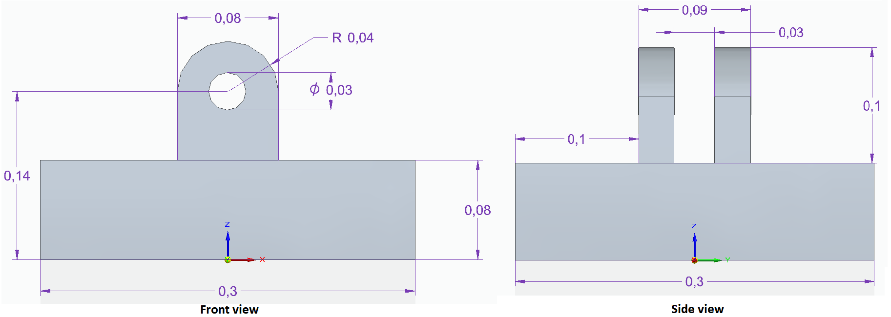
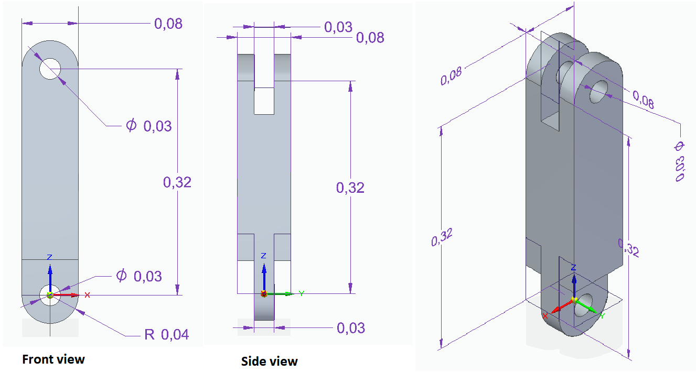
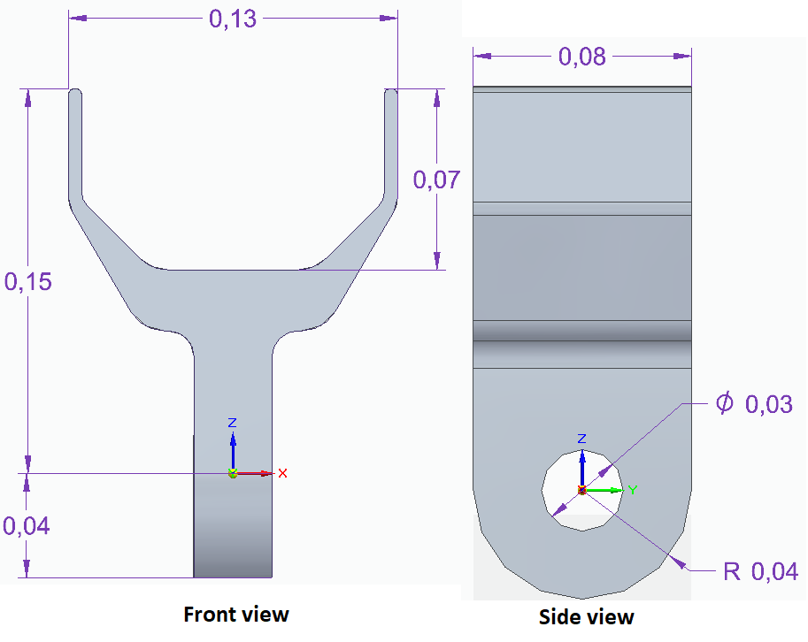

# Manipulaatorroboti URDF kirjeldus

Paigaldame kimbu `aironbot_description`, mis sisaldab 3D-mudeleid roboti lülidest. Mudeli failid asuvad kaustas `aironbot_description/meshes`

```bash
cd ~/catkin_ws/src
git clone https://github.com/unitartu-edu/aironbot_description.git
catkin build
cd ..
source devel/setup.bash
```

## Lihtsa manipulaatori visualiseerimine

```bash
cd ~/catkin_ws/src/aironbot_description/urdf/
roslaunch urdf_tutorial display.launch model:=aironbot.urdf
```

Manipulaatori mudel on kirjeldatud URDF failis, mis asub `aironbot_description/urdf` kataloogis.

**base_link** mõõdud (m):.



**link_1**:



Haaratsi fail: aironbot_description/meshes/gripper.stl

rpy (_roll, pitch, yaw_)



## Mudeli täiendamine

```bash
cd ~/catkin_ws/src/aironbot_description/urdf/
gedit aironbot.urdf
```

## Links

- https://github.com/unitartu-edu/aironbot_description
