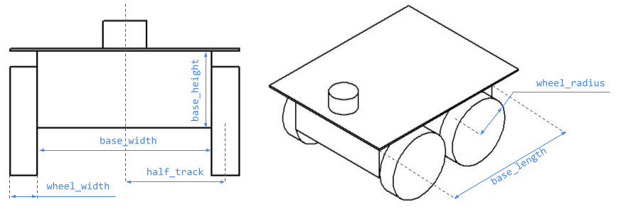

# Harjutus 3

Vajalikud kimbud: `urdf_tutorial` ja `joint-state-publisher-gui`.

## Uue kimbu (_package_) loomine

- Loob uue kimbu nimega `fourwheeler_description`.
- Uus kimp viitab kahele juba olemasolevale kimbule: `urdf` ja `xacro`

```bash
cd catkin_ws/src
catkin create pkg fourwheeler_description --catkin-deps urdf xacro
catkin build
cd..
source devel/setup.bash
```

## URDF mudeli loomine

```bash
cd ~/catkin_ws/src/fourwheeler_description
mkdir urdf
cd urdf
gedit fourwheeler.urdf
```

```xml
<?xml version="1.0"?>
<robot name="fourwheeler">

  <link name="base_link">
    <visual>
      <geometry>
        <box size="0.430 0.320 0.140" />
      </geometry>
    </visual>
  </link>

</robot>
```

## URDF mudeli visualiseerimine

```bash
roslaunch urdf_tutorial display.launch model:=fourwheeler.urdf
```

Avaneb järgnev RViz-i aken.

## URDF mudeli värvi muutmine

Värv on toodud RGBA värviruumis. Väärtused vahemikus 0–1.0.

Sulge RViz.

Ava `fourwheeler.urdf`.

```xml
<material name="blue">
  <color rgba="0 0 0.8 1" />
</material>
```

## Rata lisamine

```xml
<link name="front_right_wheel">
    <visual>
      <geometry>
        <cylinder legth="0.05" radius="0.1" />
      </geometry>
      <material name="black">
        <color rgba="0 0 0 1" />
      </material>
    </visual>
</link>
```

## Liigendi lisamine

- Lisame liigendi nimega front_right_wheel_to_base. Liigendite nimed võiksid alati näidata, milliste lülide ühendamiseks on liigend loodud. See teeb mahukates mudelites orienteerumise märgatavalt kergemaks.
- Valime liigendi tüübiks **continuous**, sest ratas saab kere suhtes pidevalt (_continuously_) pöörelda.
- Ülemlüliks (**parent link**) määrame esimese lüli base_link, kuhu peaaegu kõik roboti komponendid lõpuks kinnituvad. Alamlüliks (**child link**) määrame ratta lüli front_right_wheel, sest see peab olema seotud roboti kerega.
- Määrame liigendi algkoordinaadid xyz süsteemis. Märgendiga origin näidatud koordinaadid määravad, kui kaugel ja mis pidi asub ratas ülemlüli (antud juhul roboti kere) algkoordinaatide suhtes.
- Roboti kere koordinaatide alguspunkt (_origin_) asub kere keskel. Ratta koordinaatide alguspunkt asub ratta keskel.
- Koordinaadid xyz ehk positsioon on meetrites ja rpy (_roll, pitch, yaw_) ehk orientatsioon on toodud radiaanides.
- Pöörame ratast 90 kraadi ümber x-telje, et silindrikujuline ratas paikneks silindri külje, mitte põhja peal. Selleks määrame _roll_ väärtuseks `π/2` ehk `1.57` radiaani.
- Määrame ratta pöörlemistelje **axis**. Määrame, et ratas saab pöörelda ümber oma z-telje.

```xml
<joint name="front_right_wheel_to_base" type="continuous">
  <parent link="base_link" />
  <child link="front_right_wheel" />
  <origin xyz="0.1075 -0.1851 -0.05" rpy="1.57 0 0" />
  <axis xyz="0 0 1" />
</joint>
```

## Ülejäänud ratad

```xml
<link name="front_left_wheel">
  <visual>
    <geometry>
      <cylinder legth="0.05" radius="0.1" />
    </geometry>
    <material name="black">
      <color rgba="0 0 0 1" />
    </material>
  </visual>
</link>

<joint name="front_left_wheel_to_base" type="continuous">
  <parent link="base_link" />
  <child link="front_left_wheel" />
  <origin xyz="0.1075 0.1851 -0.05" rpy="1.57 0 0" />
  <axis xyz="0 0 1" />
</joint>

<link name="rear_right_wheel">
  <visual>
    <geometry>
      <cylinder legth="0.05" radius="0.1" />
    </geometry>
    <material name="black">
      <color rgba="0 0 0 1" />
    </material>
  </visual>
</link>

<joint name="rear_right_wheel_to_base" type="continuous">
  <parent link="base_link" />
  <child link="rear_right_wheel" />
  <origin xyz="-0.1075 -0.1851 -0.05" rpy="1.57 0 0" />
  <axis xyz="0 0 1" />
</joint>

<link name="rear_left_wheel">
  <visual>
    <geometry>
      <cylinder legth="0.05" radius="0.1" />
    </geometry>
    <material name="black">
      <color rgba="0 0 0 1" />
    </material>
  </visual>
</link>

<joint name="rear_left_wheel_to_base" type="continuous">
  <parent link="base_link" />
  <child link="rear_left_wheel" />
  <origin xyz="0.1075 0.1851 -0.05" rpy="1.57 0 0" />
  <axis xyz="0 0 1" />
</joint>
```

## Täiendavate Komponentide lisamine

Lisame roboti kere peale plaadi (_hood_). Kuna katus kere suhtes ei liigu, siis on liigendi tüüp liikumatu (_fixed_). Pole vaja defineerida pöörlemistelge (_axis_).

```xml
<link name="hood">
  <visual>
    <geometry>
      <box size="0.53 0.42 0.005" />
    </geometry>
    <material name="yellow">
      <color rgba="0.8 0.8 0 1" />
    </material>
  </visual>
</link>

<joint name="hood_to_base" type="fixed">
  <parent link="base_link" />
  <child link="hood" />
  <origin xyz="0 0 0.0725"/>
</joint>
```

## Anduri lisamine

- Loome anduri jaoks lüli nimega **lidar**. Määrame selle suuruse ja värvi. Olgu tema kõrgus (**length**) 0.08 m ja raadius (**radius**) 0.05 m.
- Loome liigendi. Peamine erinevus selle ja eelnevate liigendite vahel on see, et sensor peaks kinnituma roboti pealmise plaadi, mitte kere külge. See tähenab, et sensori lüli algkoordinaadid (origin) tuleb arvutada plaadi (hood) algkoordinaadist, mitte kere (base_link) algkoordinaadist! Asetame ta plaadi suhtes 0.150 meetri võrra x-telje suunas ja 0.04 meetri võrra z-telje suunas.
- Määrame rpy väärtuseks 0 0 0, sest me ei taha loodud silindrit plaadi suhtes pöörata.
- Et lisada paindlikkust, loome liigendi selliselt, et meie sensor saab z-telje ümber pöörelda. Selleks määrame pöörlemistelje axis väärtuse z-komponendiks 1 (ja teised komponendid nullid, kuna nende ümber me pöörelda ei taha).

```xml
<link name="lidar">
  <visual>
    <geometry>
      <cylinder length="0.08" radius="0.05" />
    </geometry>
    <material name="gray">
      <color rgba="0.7 0.7 0.7 1" />
    </material>
  </visual>
</link>

<joint name="lidar_to_hood" type="continuos">
  <parent link="hood" />
  <child link="lidar" />
  <origin xyz="0.15 0 0.004" rpy="0 0 0" />
</joint>
```

## RVizi konfihuratsioonifail

Salvestatakse kimbu `config\` kausta.

```bash
cd ~catkin_ws/src/fourwheeler_description/
mkdir config
```

File > Save Config As `fw.rviz`

## Käivitusfaili loomine

```bash
cd ~catkin_ws/src/fourwheeler_description/
mkdir launch
cd launch
gedit display.launch
```

Faili sisu:

```xml
<launch>
  <param name="robot_description" command="$(find xacro)/xacro '$(find fourwheeler_description)/urdf/fourwheeler.urdf'" />
  <node name="robot_state_publisher" pkg="robot_state_publisher" type="robot_state_publisher" />
  <node name="joint_state_publisher_gui" pkg="joint_state_publisher_gui" type="joint_state_publisher_gui" />
  <node name="rviz" pkg="rviz" type="rviz" args="-d $(find fourwheeler_description)/config/fw.rviz" />
</launch>
```

- pkg määrab kimbu nime
- type määrab faili nime, kus asub käivitatav sõlm
- name määrab nime, mille all käivitatud sõlm rosnode list kasutades hiljem kuvatakse.

Käivitamine:

```bash
roslaunch fourwheeler_description display.launch
```

## Roboti parameetriline kirjeldus

XACRO on XML-põhine makrokeel, millega saab ROSi robotitele luua parametriseeritud mudeleid.

Kuna XACRO fail on kõrgema tasemega kui URDF, on roboti mudeli ROS-is kasutamiseks vaja XACRO teisendada klassikalisse URDF formaati. Selle jaoks saab kasutada `xacro` käsku.

```bash
cd ~catkin_ws/src/fourwheeler_description/urdf
cp fourwheeler.urdf fourwheeler.urdf.xacro
```

Muuta `display.launch` fail ja muuda seda nõnda, et mudeli `fourwheeler.urdf` asemel kasutataks mudelit `fourwheeler.urdf.xacro`.

`fourwheeler.urdf.xacro` failis muuta rida `<robot>`

```xml
<robot name="fourwheeler" xmlns:xacro="http://www.ros.org/wiki/xacro">
```

### XACRO muutujaid (_property_)



```xml
<xacro:property name="base_with" value="0.52" />
<xacro:property name="wheel_with" value="0.05" />
<xacro:property name="wheel_radius" value="0.1" />
<xacro:property name="half_track" value="${base_with/2 + wheel_with/2}" />
```

Nüüd saame muuta:

```xml
<link name="base_link">
    <visual>
      <geometry>
        <box size="0.43 ${base_with} 0.14" />
      </geometry>
    </visual>
  </link>
```

```xml
<link name="front_left_wheel">
  <visual>
    <geometry>
      <cylinder legth="${wheel_with}" radius="${wheel_radius}" />
    </geometry>
    <material name="black">
      <color rgba="0 0 0 1" />
    </material>
  </visual>
</link>

<joint name="front_left_wheel_to_base" type="continuous">
  <parent link="base_link" />
  <child link="front_left_wheel" />
  <origin xyz="0.1075 ${half_track} -0.05" rpy="1.57 0 0" />
  <axis xyz="0 0 1" />
</joint>
```

## XACRO makrode loomine
